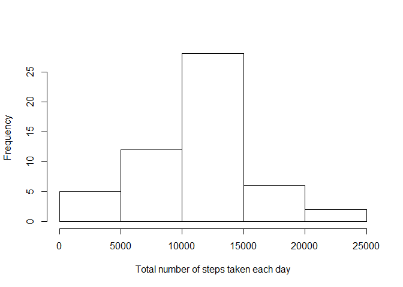
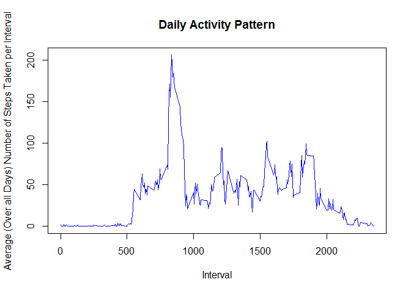
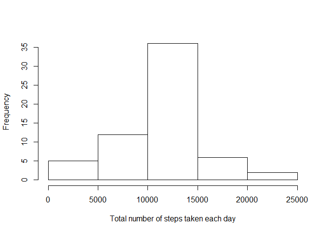
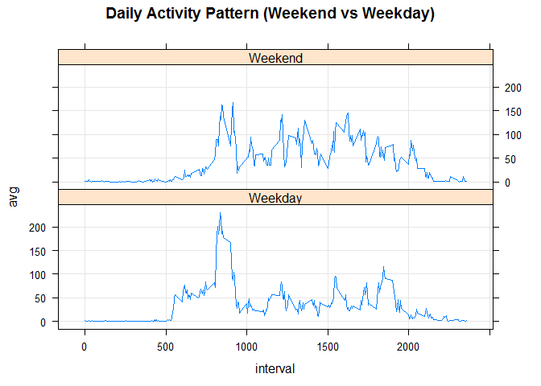

# Reproducible Research: Peer Assessment 1


## Data
In this assignment, we will make use of the data from a personal activity monitoring device. This device collects data at 5 minute intervals through out the day. The data consists of two months of data from an anonymous individual collected during the months of October and November, 2012 and include the number of steps taken in 5 minute intervals each day.

The variables included in this dataset are:

* steps: Number of steps taking in a 5-minute interval (missing values are coded as NA)

* date: The date on which the measurement was taken in YYYY-MM-DD format

* interval: Identifier for the 5-minute interval in which measurement was taken

The dataset is stored in a comma-separated-value (CSV) file and there are a total of 17,568 observations in this dataset.

## Loading and preprocessing the data
First, we unzip the dataset and load it into R. We convert the date in the dataset into "date" class using as.Date function. 

```r
unzip("activity.zip")
data <- read.csv("activity.csv")
data$date <- as.Date(data$date, format="%Y-%m-%d")
```


## What is mean total number of steps taken per day?

We first create a dataset `DataNoNA` that removes the missing values in the original data set. We Calculate the total number of steps taken per day based on the dataset `DataNoNA`. 

```r
DataNoNA <- na.omit(data)
library(dplyr)
DailyTotal <- DataNoNA %>% 
    group_by(date)%>% 
    summarise(total=sum(steps))
```

The histogram of the total number of steps taken each day is shown below.


```r
hist(DailyTotal$total,xlab="Total number of steps taken each day", main="")
```

 

The mean and median of the total number of steps taken per day are given by

```r
mean(DailyTotal$total)
```

```
## [1] 10766.19
```

```r
median(DailyTotal$total)
```

```
## [1] 10765
```


## What is the average daily activity pattern?
We calculate the average number of steps in each time interval. The average is across all days in the dateset `DataNoNA`. 


```r
DailyPattern <- DataNoNA %>% 
    group_by(interval)%>% 
    summarise(ave=mean(steps))
```

Then the daily activity pattern can be observed from the time series plot of the 5-minute interval (x-axis) and the average number of steps taken (y-axis).  


```r
plot(DailyPattern$interval,DailyPattern$ave,type="l",xlab="Interval", 
     ylab="Average (Over all Days) Number of Steps Taken per Interval",
     main="Daily Activity Pattern", col="blue")
```

 


```r
DailyPattern$interval[which.max(DailyPattern$ave)]
```

```
## [1] 835
```

We can see that the interval 835 contains the maximum number of steps. 

## Imputing missing values
The total number of missing values in the dataset is given by 

```r
sum(is.na(data$steps))
```

```
## [1] 2304
```

Next, we create another data frame `DataFillNA` that that is equal to the original dataset but with the missing data filled in by the the mean for that 5-minute interval. 

```r
DataFillNA <- data
DataFillNA <- merge(DataFillNA,DailyPattern, by="interval")
na.ind <- is.na(DataFillNA$steps)
DataFillNA$steps[na.ind] <- DataFillNA$ave[na.ind]
```

Then, we calculate the total number of steps taken each day.


```r
DailyTotal2<- DataFillNA %>% 
    group_by(date)%>% 
    summarise(total=sum(steps))
```

The histogram of the total number of steps taken each day and  the mean and median total number of steps taken per day
are shown below. 

```r
hist(DailyTotal2$total,xlab="Total number of steps taken each day", main="")
```

 

```r
mean(DailyTotal2$total)
```

```
## [1] 10766.19
```

```r
median(DailyTotal2$total)
```

```
## [1] 10766.19
```


We can see that the mean value is the same as the one estimated in the first part. However, the median value differs a little bit. 


## Are there differences in activity patterns between weekdays and weekends?
Now we create a new factor variable in the dataset with two levels - "weekday" and "weekend" indicating whether a given date is a weekday or weekend day.


```r
Weekend.ind <- weekdays(DataFillNA$date) %in% c("Saturday","Sunday")
DataFillNA$weekday[Weekend.ind] <- "Weekend"
DataFillNA$weekday[!Weekend.ind] <- "Weekday"
```

Next, we make a panel plot containing a time series plot  of the 5-minute interval (x-axis) and the average number of steps taken, averaged across all weekday days or weekend days (y-axis).

```r
DailyPattern2 <- DataFillNA %>% 
    group_by(interval,weekday)%>% 
    summarise(avg=mean(steps))

library(lattice)
xyplot(avg ~  interval| weekday, data = DailyPattern2, layout = c(1, 2),type=c("l","g"),
       main="Daily Activity Pattern (Weekend vs Weekday)")
```

 

From the panel plot, we have the following observations:

* The person starts its activity ealier on weekdays than weekends. This may be because he gets up ealier for work on weekdays. 

* The person's activities on weekends from 1000 onwards are generally more than those on weekdays.  

* The person takes most steps on weekdays around 830-930. This may be resulted from his walking to work. 

